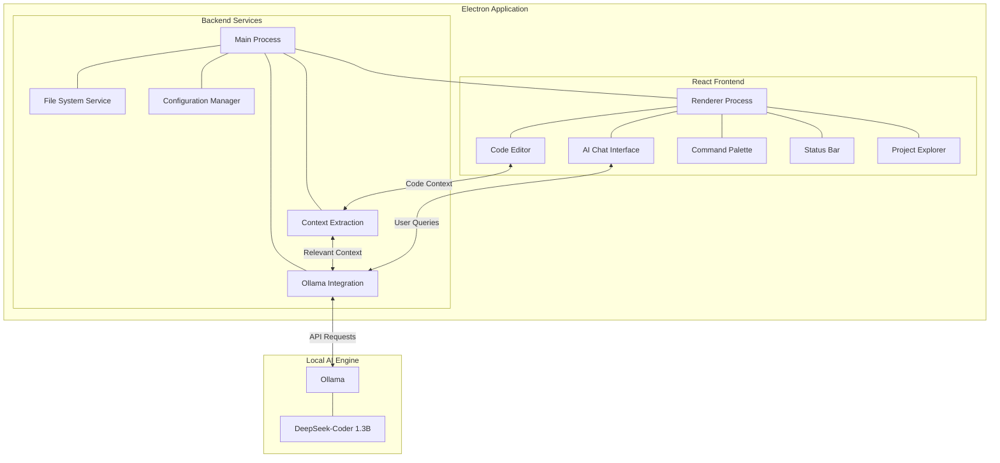

## steps to reproduce this repository

#### create an .env file and  fill the value
```
NODE_ENV=development
```
#### install electron dependencies using npm with [nodejs](https://nodejs.org/en)

```
npm install
```

#### install dependencies for frontend
```
cd src
```
```
npm install
```

### Run the deepseek-coder model locally

#### download the [ollama cli](https://ollama.com/download) 

#### download the deepseek-coder: 1.3B and make sure it runs on port `11434`
```
ollama run deepseek-coder
```

Model specifications <br>
- architecture        llama    
- parameters          1.3B     
- context length      16384    
- embedding length    2048     
- quantization        Q4_0


#### Run the electron app in the root directory of the project
```
npm run dev
```

#### To run it production ready
```
cd src
npm run build
```
#### change the .env at root folder
```
NODE_ENV=production
```

#### Run the electron app at root folder
```
npm run start
```

## Implementation Overview



## Technologies

### Core Framework
- **Electron.js**: For cross-platform desktop application
- **React.js**: For building the UI components
- **Monaco Editor**: For the code editing interface (same engine used in VS Code)
- **Ollama**: For running the local AI model
- **DeepSeek-Coder 1.3B**: The foundation model for code understanding and generation

## New Components

1. **Ollama Integration Service**:
   - A Node.js service that communicates with Ollama's REST API
   - Handles model loading, prompt construction, and response parsing

2. **AI Chat Interface**:
   - chat with AI to generate code
   - Integrates AI suggestions directly into the editor

3. **Automatic code debugging**:
   - Provides error fixes while coding
   - Provides quick fixes, refactoring suggestions


## Scaling Parameters

### Data Sizes
- **Code Context**: 1KB - 5MB per query (depends on project size)
- **Model Responses**: 1KB - 1MB per response
- **Project Size**: Supporting projects up to 1GB (50,000+ LOC)
- **Chat History**: Up to 100MB per project (persistent storage)

### Performance Estimates
- **Query Response Time**: 1-5 seconds (depends on query complexity)
- **QPS**: 0.2-0.5 queries per second (typical developer interaction)
- **Memory Usage**: 2-4GB baseline + 2-3GB for DeepSeek-Coder model
- **Storage Requirements**: 10-50MB for application, 2-3GB for model

## Rollout Strategy

1. **Alpha Phase** (Internal Testing):
   - Core functionality implementation
   - Basic integration with Ollama
   - Limited feature set focused on code understanding

2. **Beta Phase** (Limited Users):
   - Enhanced context extraction
   - Improved prompt engineering
   - Performance optimizations
   - User feedback collection

3. **v1.0 Release**:
   - Full feature set
   - Documentation and examples
   - Installers for major operating systems
   - Auto-update system

4. **Continuous Updates**:
   - Regular model updates
   - Feature enhancements based on user feedback
   - Performance optimizations

## Security & Privacy Concerns

### Primary Concerns
1. **Code Privacy**: Developer code could contain sensitive information
2. **Model Security**: Ensuring the model doesn't produce harmful outputs
3. **Dependency Vulnerabilities**: Security of third-party libraries
4. **System Access**: Application permissions on user's computer

### Mitigation Strategies
1. **Local-Only Processing**:
   - All code stays on user's machine
   - No data sent to external servers
   - Ollama runs locally with no external communication

2. **Secure Storage**:
   - Encryption for saved conversations
   - Safe handling of project files
   - Option to disable persistent storage

3. **Input Validation**:
   - Sanitizing all inputs to prevent injection attacks
   - Strict validation of model responses
